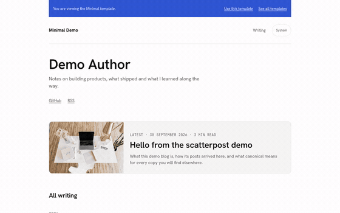
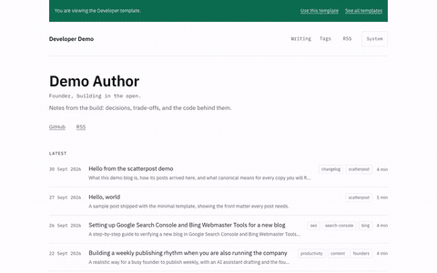
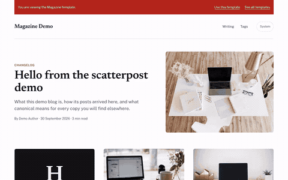
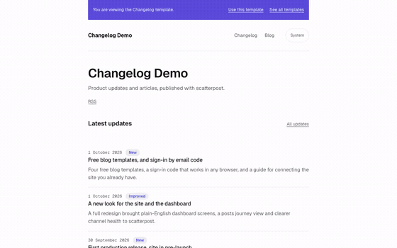

# Free Next.js blog templates for founders

Four free, MIT-licensed Next.js blog templates: one repository, each
template a self-contained app you can deploy on its own. Made by
[scatterpost](https://scatterpost.io), which lets your AI assistant
publish to your blog first, then share it to Dev.to, Hashnode,
LinkedIn, Bluesky, Mastodon and more, with every copy linking back to
your site.

## Pre-configured for AI and search

- **Ready for your AI agent**: scatterpost can publish to it from
  Claude, Cursor or any MCP client as soon as you paste in one secret.
  No webhook code to write.
- **Easy for AI assistants to read**: every post ships with structured
  data and an `llms.txt` file, so AI assistants can understand and
  quote your writing.
- **Set up for search**: sitemap, RSS feed, canonical links and social
  preview images come built in. Add a key and new posts ping IndexNow
  too.
- **Yours to own and change**: your domain, your Vercel account, MIT
  licence. Light and dark mode and a cookie consent banner are already
  done.

## Preview

Demos go live once each template is deployed to `demo.scatterpost.io`;
until then the links below may 404.

<table>
  <tr>
    <td width="50%">
      <a href="https://demo.scatterpost.io/minimal/">
        
      </a>
      <br>
      <strong>Minimal</strong>: single column, readable, serif, light and dark.
      <br>
      <a href="https://demo.scatterpost.io/minimal/">Live demo</a> ·
      <a href="https://vercel.com/new/clone?repository-url=https%3A%2F%2Fgithub.com%2FSheldon-desouza%2Fscatterpost-blog-templates%2Ftree%2Fmain%2Fminimal&project-name=my-blog&repository-name=my-blog&stores=%5B%7B%22type%22%3A%22blob%22%7D%5D&env=NEXT_PUBLIC_SITE_URL,SCATTERPOST_WEBHOOK_SECRET">Deploy</a>
    </td>
    <td width="50%">
      <a href="https://demo.scatterpost.io/developer/">
        
      </a>
      <br>
      <strong>Developer</strong>: syntax highlighting, table of contents, dark-first.
      <br>
      <a href="https://demo.scatterpost.io/developer/">Live demo</a> ·
      <a href="https://vercel.com/new/clone?repository-url=https%3A%2F%2Fgithub.com%2FSheldon-desouza%2Fscatterpost-blog-templates%2Ftree%2Fmain%2Fdeveloper&project-name=my-blog&repository-name=my-blog&stores=%5B%7B%22type%22%3A%22blob%22%7D%5D&env=NEXT_PUBLIC_SITE_URL,SCATTERPOST_WEBHOOK_SECRET">Deploy</a>
    </td>
  </tr>
  <tr>
    <td width="50%">
      <a href="https://demo.scatterpost.io/magazine/">
        
      </a>
      <br>
      <strong>Magazine</strong>: card grid home with cover images, tags and categories.
      <br>
      <a href="https://demo.scatterpost.io/magazine/">Live demo</a> ·
      <a href="https://vercel.com/new/clone?repository-url=https%3A%2F%2Fgithub.com%2FSheldon-desouza%2Fscatterpost-blog-templates%2Ftree%2Fmain%2Fmagazine&project-name=my-blog&repository-name=my-blog&stores=%5B%7B%22type%22%3A%22blob%22%7D%5D&env=NEXT_PUBLIC_SITE_URL,SCATTERPOST_WEBHOOK_SECRET">Deploy</a>
    </td>
    <td width="50%">
      <a href="https://demo.scatterpost.io/changelog/">
        
      </a>
      <br>
      <strong>Changelog</strong>: blog plus a changelog timeline.
      <br>
      <a href="https://demo.scatterpost.io/changelog/">Live demo</a> ·
      <a href="https://vercel.com/new/clone?repository-url=https%3A%2F%2Fgithub.com%2FSheldon-desouza%2Fscatterpost-blog-templates%2Ftree%2Fmain%2Fchangelog&project-name=my-changelog&repository-name=my-changelog&stores=%5B%7B%22type%22%3A%22blob%22%7D%5D&env=NEXT_PUBLIC_SITE_URL,SCATTERPOST_WEBHOOK_SECRET">Deploy</a>
    </td>
  </tr>
</table>

## What every template includes

- `POST /api/scatterpost` and `GET /api/scatterpost/pull`, the two ways
  to connect to scatterpost (push and pull)
- Generated `sitemap.xml`
- An RSS feed
- Canonical links on every page
- JSON-LD structured data
- Generated Open Graph images for every post
- A generated `llms.txt`, a plain-text summary for an AI assistant to read directly
- IndexNow pings on publish, once you set `INDEXNOW_KEY` (off by default)
- Light and dark mode
- A cookie consent banner that gates analytics: nothing loads, and no cookie is set, until a visitor agrees
- Accessible, semantic markup
- MIT licence

## Deploy in one click

Each button below clones that one template into its own repository on
your own Vercel account, with the project's "Root Directory" preset to
that template, and provisions a private Vercel Blob store for it.

| Template | Deploy |
|---|---|
| [`minimal/`](./minimal) | [](https://vercel.com/new/clone?repository-url=https%3A%2F%2Fgithub.com%2FSheldon-desouza%2Fscatterpost-blog-templates%2Ftree%2Fmain%2Fminimal&project-name=my-blog&repository-name=my-blog&stores=%5B%7B%22type%22%3A%22blob%22%7D%5D&env=NEXT_PUBLIC_SITE_URL,SCATTERPOST_WEBHOOK_SECRET) |
| [`developer/`](./developer) | [](https://vercel.com/new/clone?repository-url=https%3A%2F%2Fgithub.com%2FSheldon-desouza%2Fscatterpost-blog-templates%2Ftree%2Fmain%2Fdeveloper&project-name=my-blog&repository-name=my-blog&stores=%5B%7B%22type%22%3A%22blob%22%7D%5D&env=NEXT_PUBLIC_SITE_URL,SCATTERPOST_WEBHOOK_SECRET) |
| [`magazine/`](./magazine) | [](https://vercel.com/new/clone?repository-url=https%3A%2F%2Fgithub.com%2FSheldon-desouza%2Fscatterpost-blog-templates%2Ftree%2Fmain%2Fmagazine&project-name=my-blog&repository-name=my-blog&stores=%5B%7B%22type%22%3A%22blob%22%7D%5D&env=NEXT_PUBLIC_SITE_URL,SCATTERPOST_WEBHOOK_SECRET) |
| [`changelog/`](./changelog) | [](https://vercel.com/new/clone?repository-url=https%3A%2F%2Fgithub.com%2FSheldon-desouza%2Fscatterpost-blog-templates%2Ftree%2Fmain%2Fchangelog&project-name=my-changelog&repository-name=my-changelog&stores=%5B%7B%22type%22%3A%22blob%22%7D%5D&env=NEXT_PUBLIC_SITE_URL,SCATTERPOST_WEBHOOK_SECRET) |

Each template's own README has the same button, plus the full
environment variable table and both connection modes (push and pull).

## Connect it to scatterpost in three steps

1. Deploy a template with the button above.
2. In scatterpost, add a Website channel and paste the secret it gives
   you into the blog's `SCATTERPOST_WEBHOOK_SECRET` env var, then
   redeploy. See the
   [website connector docs](https://scatterpost.io/docs/website-connector),
   or [connecting an existing site](https://scatterpost.io/docs/existing-site)
   if you already have a blog.
3. Ask your assistant to publish. scatterpost posts to your new blog
   first, then cross-posts elsewhere with the canonical link pointing
   home.

## Why use a template instead of building your own

You could build a blog from scratch. These templates skip the parts
that take the longest to get right.

**Ready for scatterpost on day one.** The part that receives your posts
is already built. Paste the secret from scatterpost into your blog's
settings and your assistant can publish straight away. No webhook code
to write or test.

**Search basics done for you.** Sitemap, RSS feed, canonical links,
structured data and social preview images are generated from every
post, plus an `llms.txt` file that helps AI assistants read your site.

**Each template is ready to ping IndexNow when you add a key**, so
search engines that support it, such as Bing, can hear about a new
post instead of waiting for the next crawl.

**Yours to keep.** MIT licensed, on your own domain and your own
Vercel account. Change anything you like. If you stop using
scatterpost, the blog and every post stay with you.

**Small details already handled.** Light and dark mode, readable on a
phone, keyboard friendly, and a cookie consent banner that only loads
analytics after a visitor agrees.

Already have a website? You do not need a template. Connect your
existing site in scatterpost instead.

## FAQ

**Is it free?**
Yes. All four templates are free and MIT licensed; deploying one to
Vercel runs on Vercel's own free tier. scatterpost itself is a
separate paid product you only need if you want to publish from an AI
assistant.

**Do I need scatterpost to use these templates?**
No. Each template works as a normal Next.js blog on its own. scatterpost
adds the ability to publish to it, and cross-post elsewhere, from an AI
assistant.

**Can I use my own domain?**
Yes. Point any domain at the Vercel project and set
`NEXT_PUBLIC_SITE_URL` to it; every canonical link, the sitemap, the
feed and `llms.txt` follow automatically.

**Can I customise the design?**
Yes. Each template is a plain Next.js app you own outright: edit the
components, the CSS or the content, there is nothing scatterpost-specific
to preserve.

**Where are posts stored?**
In Vercel Blob by default once deployed, with a file store
(`content/posts/*.md`) for local development and an optional Supabase
store as an alternative. `CONTENT_STORE` chooses between them.

**Do they work with Claude, ChatGPT or Cursor?**
scatterpost is an MCP server, so any MCP client that can call tools
works with it; see scatterpost's own docs for the clients it documents
connecting, which currently include Claude Code, Claude.ai and Cursor.

**How do I remove the "Built with" credit?**
Set `NEXT_PUBLIC_SHOW_SCATTERPOST_CREDIT=false` in the deployed
project's environment variables and redeploy.

## About scatterpost

scatterpost is the publishing pipeline for AI agents: your assistant
writes the post, scatterpost publishes it to your own blog first, then
cross-posts it to Dev.to, Hashnode, LinkedIn, Bluesky, Mastodon and
more, with the canonical link pointing back home. These templates are
free and MIT licensed on their own; scatterpost is the separate, paid
tool that connects to them. Try it at [scatterpost.io](https://scatterpost.io).

## Reference

### Search and analytics setup

See [`SETUP.md`](./SETUP.md) for a plain-English walkthrough: Google
Search Console and Bing Webmaster Tools verification, optional GA4
analytics behind a consent banner, and optional IndexNow pings on
publish. Every template already generates `robots.txt`, `sitemap.xml`
and `llms.txt` with nothing to configure.

### Repository layout

```
LICENSE            MIT, Copyright (c) 2026 Sheldon de Souza
shared/             the scatterpost connector code once: signature verification,
                    payload validation, the content stores (Vercel Blob, Supabase,
                    file), pull, slugify, safe HTML and Markdown rendering, plus
                    their tests
scripts/sync-shared.mjs   copies shared/ into <template>/src/lib/scatterpost/;
                          --check exits 1 if any copy has drifted
demo/               static gallery site for demo.scatterpost.io; Vercel Root Directory = demo
minimal/            self-contained Next.js app; Vercel Root Directory = minimal
developer/          self-contained Next.js app; Vercel Root Directory = developer
magazine/           self-contained Next.js app; Vercel Root Directory = magazine
changelog/          self-contained Next.js app; Vercel Root Directory = changelog
```

Each template is self-contained: its own `package.json` and
`package-lock.json`, no `workspace:` or `@scatterpost/*` dependency, so
`npm install` works from a plain copy of that one folder. The connector
code under each template's `src/lib/scatterpost/` is a synced copy of
`shared/`, never hand-edited; run `npm run sync` from the repository
root after changing `shared/`, and `npm run check` to confirm nothing
has drifted.

### Connecting to scatterpost

Every template ships `POST /api/scatterpost` (push mode: scatterpost
calls this site) and `GET /api/scatterpost/pull` (pull mode: this site
polls scatterpost on a schedule). Whichever mode you use, the template's
own URL for a post becomes the canonical scatterpost cross-posts with.
See a template's README for the exact steps and the JSON shape scatterpost
expects.

### Storage

Vercel Blob is the default store once deployed with the button above (it
provisions a private Blob store for you); Supabase is kept as an
optional alternative, and the file store (`content/posts/*.md`) is for
local development. `CONTENT_STORE` chooses between them; see a
template's `.env.example`.

### Licence

MIT. This repository is independent of scatterpost's own proprietary
codebase: nothing here depends on a private package, and these
templates may be used, forked and redeployed freely under the terms of
the licence.
